# ChaNet — Thai Tea Drink Classification with Fine-tuned CNNs

**DADS7202 Deep Learning (1/2569), GSAS NIDA — Midterm Project**
**Group:** Hey Tea

| Name | Student ID |
|---|---|
| กฤตณัฐ ทับทิมแก้ว | 6810422006 |
| พิมกนิษฐ์ ทองศรีแก้ว | 6810422011 |
| สมฤดี การภักดี | 6810422023 |

We built our own image dataset of 5 Thai tea drinks and fine-tuned 4 ImageNet-pretrained CNNs
(VGG-16, ResNet-50, EfficientNet-B3, MobileNet-V3-Large), each trained with 5 random seeds on one fixed,
leakage-safe **group split**. **All numbers below are on the held-out test set and reported as mean ± SD over 5 seeds.**

| Result | |
|---|---|
| Best models | **ResNet-50** (macro F1 0.891 ± 0.017) ≈ **EfficientNet-B3** (0.883 ± 0.017); difference not significant (Welch p = 0.48) |
| Worst model | VGG-16 (macro F1 0.795 ± 0.023), significantly below all others (p ≤ 0.011, \|Hedges' g\| ≥ 1.96) |
| Main error mode | Drinks with overlapping colour: orange fruit teas → Thai tea, dark fruit teas → black tea |
| Hyperparameter tuning | Optuna + W&B Sweep (78 trials, validation set). Re-training with the tuned values gave **no significant test change** for any model (§6.7) |

---

## Contents
1. [Dataset](#1-dataset)
2. [Data preparation](#2-data-preparation)
3. [Model architectures](#3-model-architectures)
4. [Training method](#4-training-method)
5. [Evaluation metrics](#5-evaluation-metrics)
6. [Experimental results](#6-experimental-results)
7. [Discussion & conclusions](#7-discussion--conclusions)
8. [Reproducibility](#8-reproducibility)

---

## 1. Dataset

### 1.1 Classes
None of these drinks has its own class in ImageNet-1k (the closest are generic classes like _eggnog_, _espresso_, _beer glass_).

| Class | Thai | Description |
|---|---|---|
| `cha_thai` | ชาไทย / ชาเย็น | Thai iced milk tea, bright orange |
| `cha_dam_yen` | ชาดำเย็น | Thai iced black tea, no milk, clear dark brown-orange |
| `cha_khiao_nom` | ชาเขียวนม | Iced green milk tea / matcha latte |
| `cha_nom_khai_muk` | ชานมไข่มุก | Bubble milk tea with tapioca pearls |
| `cha_phonlamai` | ชาผลไม้ | Iced fruit tea (peach, lychee, passion fruit, mixed fruit) |

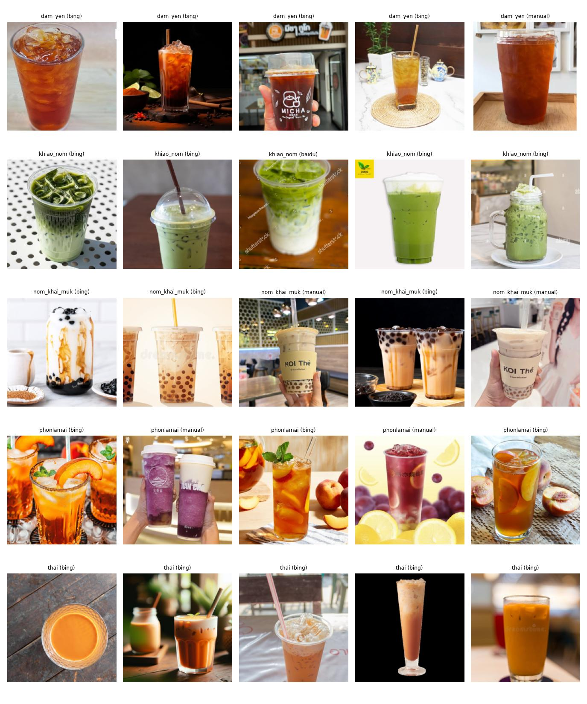
_5 random images per class (source in brackets)._

### 1.2 Data sources and collection
| Source | How | Images in final set |
|---|---|---|
| **Bing image search** | `ddgs` (Bing backend), 8 keywords per class: 6 Thai + 2 English, 100 images per keyword | 669 |
| **Baidu image search** | `icrawler`, English keywords only (Thai keywords returned unrelated images) | 132 |
| **Delivery apps / Facebook** (Grab, LINE MAN, shop pages) | collected by hand, **1 image per shop per class** | 112 |

Keywords were kept **symmetric across classes** (same templates, same Thai/English mix, same engines) so the model cannot
learn "search style" instead of drink type. The full keyword list is in [`chanet_scraper.py`](chanet_scraper.py).

### 1.3 Cleaning pipeline
| Step | Images |
|---|---|
| Downloaded (2 scraping rounds) | 4,373 |
| Near-duplicates removed (perceptual hash, pHash distance ≤ 6, including cross-class duplicates) | − 1,192 → 3,181 |
| CLIP zero-shot triage, then **every image reviewed by eye** on numbered contact sheets ([`chanet_curate.py`](chanet_curate.py)) | 878 kept (73 moved to their correct class) |
| Second manual review by team (unusable images deleted) | − 77 → 801 |
| Delivery-app / Facebook photos added (deduplicated with pHash + dHash against all existing images) | + 112 → **913** |

**Rules applied to every class:** keep real photos where the class drink is the main subject in a glass or cup; remove
drawings / 3D renders, logos, menus or posters where text dominates, hot tea in ceramic cups, packaged products,
collages, and **ambiguous drinks** (Thai/green tea with pearls, lemon tea, iced black coffee, obvious AI renders).
CLIP was used only to *order* images for review. Nothing was removed automatically based on CLIP's class prediction,
otherwise the dataset would keep only the images CLIP finds easy.

### 1.4 EDA

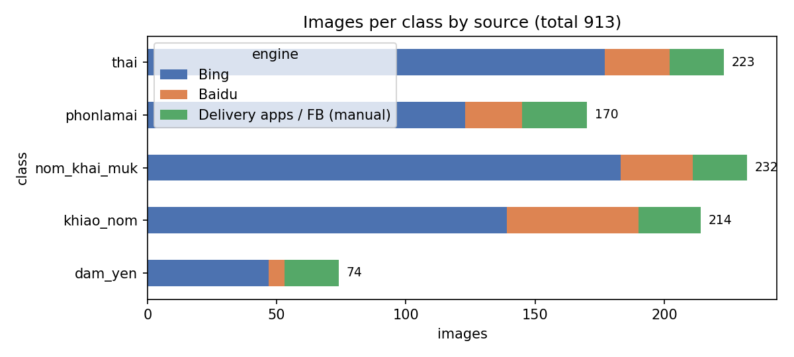

| | dam_yen | khiao_nom | nom_khai_muk | phonlamai | thai |
|---|---|---|---|---|---|
| Images | **74** | 214 | 232 | 170 | 223 |
| Median width × height (px) | 980 × 1088 | 1024 × 1400 | 1117 × 1133 | 1024 × 1059 | 1001 × 1024 |
| Median aspect ratio (w/h) | 1.00 | 0.75 | 0.90 | 1.00 | 1.00 |
| Mean brightness (0–255) | 137 | 156 | 151 | 151 | 145 |

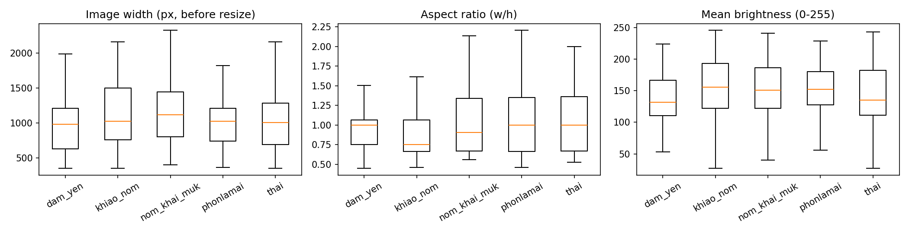

- All images are colour (0 grayscale); the shortest side is ≥ 350 px.
- Sizes and brightness are similar across classes. `cha_khiao_nom` has more portrait images (aspect 0.75), which disappears after resize + crop.

### 1.5 ⚠️ Class imbalance
**The dataset is imbalanced: `cha_dam_yen` has 74 images vs. 232 for `cha_nom_khai_muk` (ratio 3.14 : 1).**
Iced black tea is rarely photographed on its own online, and most search results were Thai milk tea, lemon tea or iced coffee.
We added 21 hand-collected photos but chose not to inflate the class with lower-quality images.

How we handle it:
- **Training:** class-weighted cross-entropy (weight ∝ 1 / class frequency, `cha_dam_yen` ≈ 2.5×).
- **Evaluation:** **macro** F1 is our primary metric (every class counts equally); per-class precision and recall are reported.
- **Ablation:** 4 imbalance strategies compared in [§6.6](#66-class-imbalance-strategies-ablation). Result: no strategy is
  significantly better; class weighting raises `cha_dam_yen` recall to 1.00 at the cost of precision.

---

## 2. Data preparation

### 2.1 Train / validation / test split — group split
A random split would leak information: images from the same search query (same shop, same stock-photo series) or the same
shop would end up in both train and test. We therefore split by **group**:

| Image source | Group |
|---|---|
| Scraped | search class + keyword + engine (e.g. `cha_thai | kw03 | bing`) |
| Hand-collected | shop (1 image = 1 group unless several photos came from one shop) |

160 groups were assigned to train / val / test so that **every class and every source is close to 70 / 10 / 20** (max deviation 2.2 % per class, 3.9 % per source).
No group appears in more than one split. The split is fixed in [`tea_dataset/split.csv`](tea_dataset/split.csv) and used by every model and seed
([`training/make_split.py`](training/make_split.py)).

| | dam_yen | khiao_nom | nom_khai_muk | phonlamai | thai | **total** |
|---|---|---|---|---|---|---|
| train | 51 | 152 | 160 | 120 | 155 | **638** |
| val | 9 | 23 | 24 | 15 | 22 | **93** |
| test | 14 | 39 | 48 | 35 | 46 | **182** |

**Leakage check (pilot, ResNet-50, 1 seed):** group split test accuracy 0.918 / macro F1 0.909 vs. random stratified split 0.902 / 0.904.
Random split was *not* higher, so the scraped groups do not leak. Accuracy ~0.9 (not ~0.99) is plausible for this task.

### 2.2 Preprocessing (in order)
1. Decode as RGB (palette / RGBA images converted).
2. **Train:** online augmentation (§2.3), which ends with a random crop to 224 × 224.
   **Val / test:** resize short side to 256, then centre crop 224 × 224.
3. `ToTensor` (pixel values 0–255 → 0–1), then normalise with ImageNet mean / std.
4. Batch size 32. The **training set is reshuffled every epoch**. Val / test keep a fixed order.

### 2.3 Data augmentation (online, train only)
`RandomResizedCrop(224, scale 0.8–1.0)` · `RandomHorizontalFlip(0.5)` · `RandomRotation(15°)` ·
`ColorJitter(brightness 0.3, contrast 0.3, saturation 0.3, hue 0.1)` · `RandomGrayscale(0.1)`

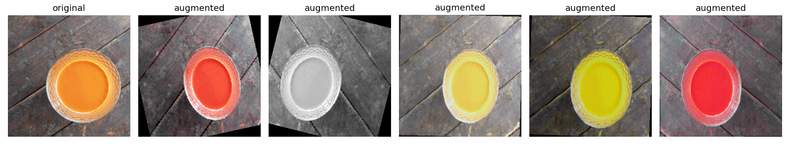

---

## 3. Model architectures

### 3.1 Backbones (4 different families)
| Model | Params | Why |
|---|---|---|
| **VGG-16** | 134.3 M | Plain deep stack of 3×3 convolutions, no skip connections: the classic baseline |
| **ResNet-50** | 23.5 M | Residual (skip) connections + bottleneck blocks: the standard strong backbone |
| **EfficientNet-B3** | 10.7 M | Compound scaling of depth/width/resolution, MBConv + squeeze-excitation |
| **MobileNet-V3-Large** | 4.2 M | Depthwise-separable convolutions + NAS-designed blocks: lightweight / mobile |

All use torchvision ImageNet weights (`VGG16_IMAGENET1K_V1`, `ResNet50_IMAGENET1K_V2`, `EfficientNet_B3_IMAGENET1K_V1`, `MobileNet_V3_Large_IMAGENET1K_V2`).

### 3.2 Pre-trained CNNs before fine-tuning
All 4 original ImageNet models (no layers changed, no training) on the same 5 test images, one per class:

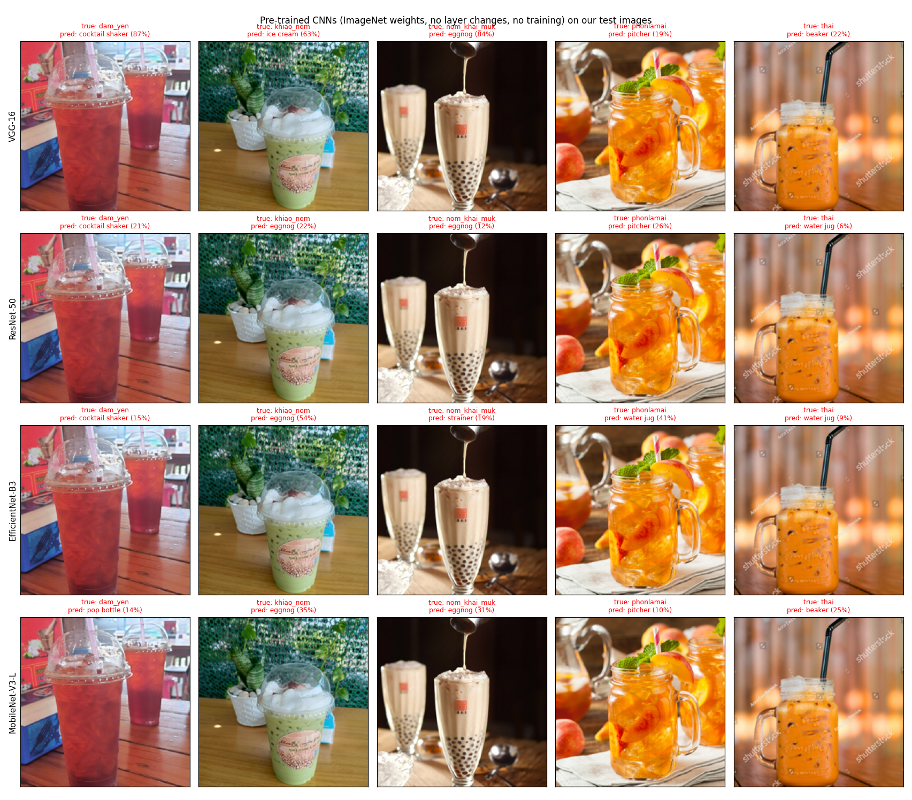

ImageNet has no tea-drink classes, so every model falls back to containers or other drinks: _cocktail shaker, pitcher,
water jug, beaker, pop bottle, strainer, ice cream_, and above all _eggnog_, which is predicted for green milk tea and bubble tea alike.
None of these labels tells the 5 drinks apart, so fine-tuning is needed. More examples (ResNet-50, 10 images): [`report/baseline_imagenet.png`](report/baseline_imagenet.png).

### 3.3 Removed layers and new classification head
Only the final 1000-class layer of each model is replaced. Everything before it is kept with its pretrained weights.

| Model | Removed | New head |
|---|---|---|
| VGG-16 | `classifier[6]`: Linear(4096 → 1000) | Dropout(0.5) → Linear(4096 → 5). Keeps the two pretrained FC-4096 layers (ReLU + Dropout 0.5) |
| ResNet-50 | `fc`: Linear(2048 → 1000) | Dropout(0.3) → Linear(2048 → 5), after global average pooling |
| EfficientNet-B3 | `classifier[1]`: Linear(1536 → 1000) | Dropout(0.3) → Linear(1536 → 5) (original Dropout 0.3 before it is kept) |
| MobileNet-V3-L | `classifier[3]`: Linear(1280 → 1000) | Dropout(0.3) → Linear(1280 → 5). Keeps Linear(960 → 1280) + Hardswish + Dropout |

---

## 4. Training method

### 4.1 Two-stage fine-tuning
| | Stage 1: head only | Stage 2: fine-tune top layers |
|---|---|---|
| Trainable layers | classifier head only (backbone frozen) | VGG: `features[24:]` (last conv block) + classifier · ResNet: `layer4` + `fc` · EfficientNet / MobileNet: last 3 feature blocks + classifier |
| Trainable params | VGG 119.6 M · ResNet 10 k · EffNet 7.7 k · MobileNet 1.24 M | VGG 126.6 M · ResNet 15.0 M · EffNet 8.5 M · MobileNet 3.0 M |
| Optimizer | Adam, lr 1e-3 | AdamW, lr 1e-4 (MobileNet 5e-5) |
| Max epochs | 10 (MobileNet 5) | 15 (MobileNet 20) |
| Scheduler | Cosine annealing over the stage | Cosine annealing over the stage |

- **Loss:** cross-entropy with class weights (label smoothing 0.05 for VGG-16, 0 otherwise).
- **Batch size** 32 · **input** 224 × 224 · **early stopping** patience 5 on validation weighted F1. The best-validation checkpoint
  of each stage is kept, and stage 2 starts from the best stage-1 weights.
- **Seeds:** 11, 22, 33, 44, 55 (same set for every model). The seed changes head initialisation, dropout, augmentation and batch order. The split stays fixed.
- **Hardware:** Kaggle, NVIDIA Tesla T4.
- **Hyperparameters:** the values above are the defaults used in the main comparison (§6.1–6.6). They were then tuned with
  **Optuna and W&B Sweep** (§4.3), and all 4 models were re-trained with the tuned values (§6.7).

### 4.2 Learning curves (final runs, all 4 models)
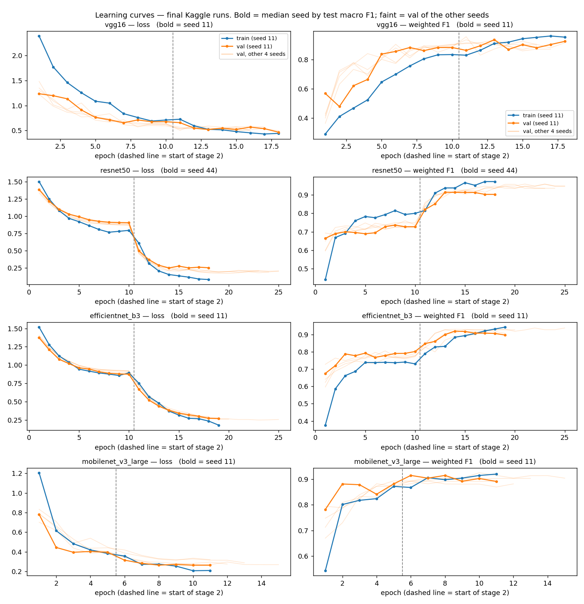
_Parsed from the Kaggle log of the final run ([`results_kaggle/logs/final_v2.log`](results_kaggle/logs/final_v2.log)).
Bold lines = the **median seed** of each model by test macro F1 (VGG-16 11, ResNet-50 44, EfficientNet-B3 11, MobileNet-V3 11).
Faint lines = validation curves of the other 4 seeds. Dashed line = start of stage 2._

| At the last epoch (mean ± SD, 5 seeds) | train F1 | val F1 | train − val F1 | epochs run (min–max) |
|---|---|---|---|---|
| VGG-16 | 0.958 ± 0.011 | 0.902 ± 0.021 | 0.056 | 16–18 |
| ResNet-50 | 0.982 ± 0.007 | 0.933 ± 0.018 | 0.049 | 18–25 |
| EfficientNet-B3 | 0.929 ± 0.010 | 0.915 ± 0.017 | 0.014 | 18–25 |
| MobileNet-V3-L | 0.934 ± 0.016 | 0.895 ± 0.009 | 0.039 | 11–15 |

- **Stage 1 (frozen backbone) underfits.** For ResNet-50 and EfficientNet-B3 val F1 plateaus at ~0.72–0.80 with only the linear head trainable.
  Unfreezing the top blocks in stage 2 gives the main jump (+0.15–0.20 val F1). This justifies the two-stage design.
- **No strong overfitting.** The final train-val gap is small (0.01–0.06). ResNet-50 has the largest train fit (0.98) but its validation loss
  keeps decreasing and then flattens instead of rising. **VGG-16 has the highest validation loss (0.51 vs 0.21–0.28)** and the noisiest val
  curve, which matches its worst test score.
- **Early stopping triggered** in most runs (patience 5), so models stop once val F1 stops improving (VGG-16 after 16–18 of 25 epochs).
- Train F1 is sometimes *below* val F1 early on. Train metrics are measured on augmented images with dropout active, while val uses clean
  centre crops. This is expected and not a leak.

### 4.3 Hyperparameter tuning: Optuna + W&B Sweep
Both tools searched **the same space**, separately for each architecture, with the same fixed seed (42), and scored each trial by its
**best validation weighted F1**. The test set was not used. Code: [`run_tune_optuna.py`](training/run_tune_optuna.py),
[`run_sweep.py`](training/run_sweep.py), [`tuning.py`](training/tuning.py). All trials: [`trials.csv`](results_kaggle/tuning/trials.csv).

| Hyperparameter | Values searched (108 combinations per model) |
|---|---|
| stage-1 learning rate | 5e-4, 1e-3 |
| stage-1 epochs | 5, 10 |
| stage-2 learning rate | 1e-5, 5e-5, 1e-4 |
| stage-2 epochs | 10, 15, 20 |
| label smoothing | 0, 0.05, 0.1 |

| | Optuna | W&B Sweep |
|---|---|---|
| Search method | TPE sampler (4 random start-up trials), **median pruning** in stage 2 | Bayesian optimisation |
| Budget per model | 10 trials | 10 runs |
| Trials run (all models) | 38 (6 pruned early; repeated suggestions reused, not retrained) | 40 |
| GPU time (Kaggle T4) | 2.6 h | 2.9 h |
| Best val F1 found: VGG-16 / ResNet-50 / EffNet-B3 / MobileNet-V3 | 0.936 / **0.957** / 0.948 / 0.914 | **0.957** / **0.957** / **0.949** / **0.915** |

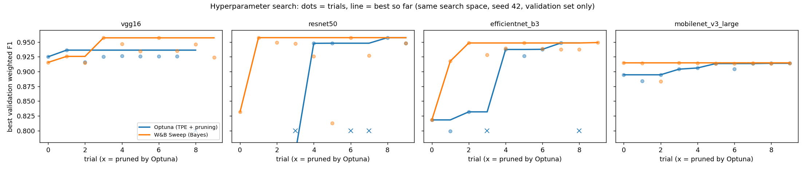

**Selected values** (best validation F1 over both tools, [`best_hparams.json`](results_kaggle/tuning/best_hparams.json)):

| Model | stage-1 lr | stage-1 epochs | stage-2 lr | stage-2 epochs | label smoothing | chosen from |
|---|---|---|---|---|---|---|
| VGG-16 | 1e-3 | 5 | 1e-4 | 20 | 0.1 | W&B Sweep |
| ResNet-50 | 5e-4 | 10 | 1e-4 | 15 | 0 | Optuna (tied with Sweep) |
| EfficientNet-B3 | 5e-4 | 10 | 1e-4 | 20 | 0.1 | W&B Sweep |
| MobileNet-V3-L | 5e-4 | 10 | 5e-5 | 10 | 0.05 | W&B Sweep |

- **The two tools end up equal.** Their best values differ by ≤ 0.002 except VGG-16 (0.957 vs 0.936). On a 93-image validation set,
  0.01 F1 is about one image, and several configurations tie at the top (e.g. 3 ResNet-50 trials at 0.957).
- **Optuna was cheaper** (2.6 h vs 2.9 h) because pruning stopped bad stage-2 runs early. Its first random trials were weaker, so it
  needed more trials to catch up (ResNet-50, EfficientNet-B3 panels).
- The searches agree on **stage-2 lr = 1e-4** for the three larger models. Mild label smoothing helps VGG-16 and EfficientNet-B3.

**W&B Sweep dashboards** (screenshots; the project is under the NIDA organisation and cannot be made public). Each shows best val F1 per
run over time, W&B's parameter importance (random-forest importance + correlation with `best_val_f1`), and a parallel-coordinates plot.

| ResNet-50 sweep | VGG-16 sweep |
|---|---|
| 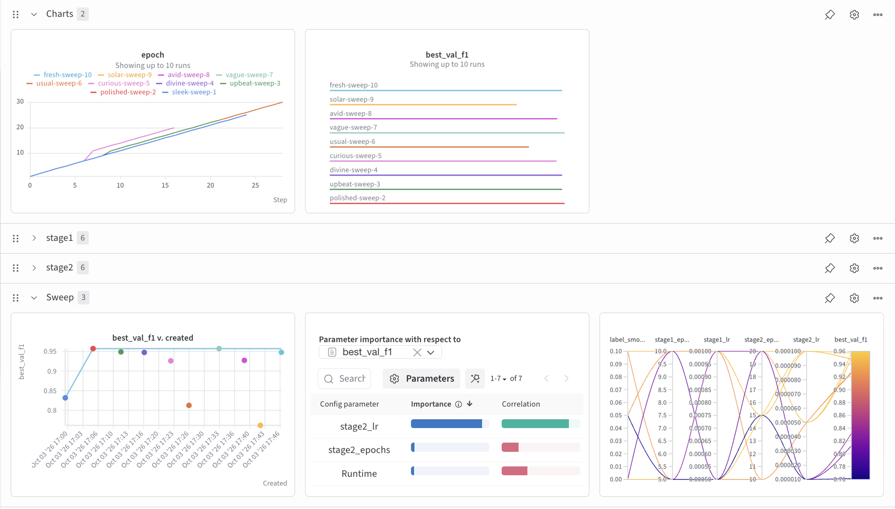 | 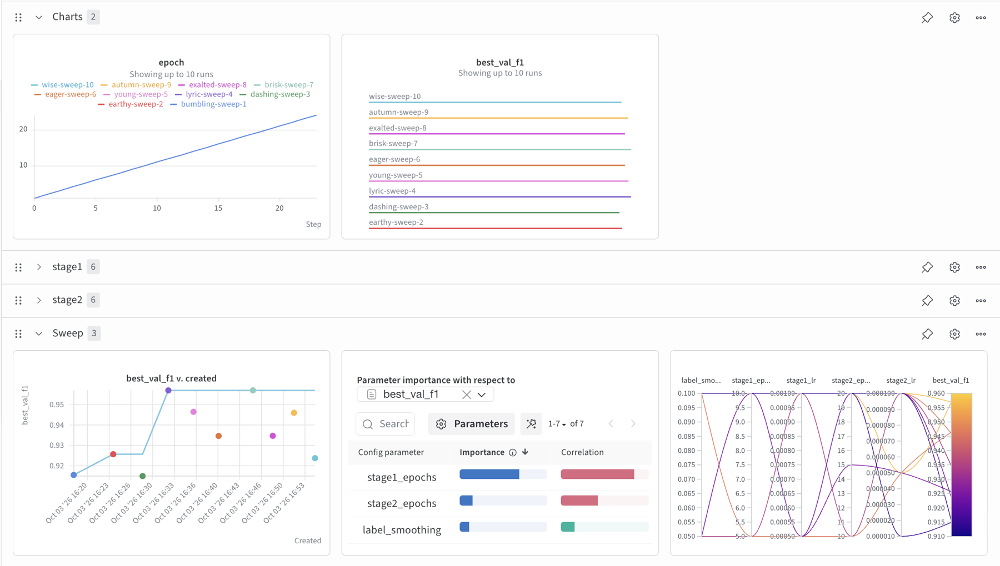 |

- **ResNet-50:** `stage2_lr` is by far the most important parameter, with a **positive** correlation: the higher stage-2 learning rate
  (1e-4) is better. Runs with 1e-5 are the low outliers (~0.77–0.82). This matches the selected value.
- **VGG-16:** `stage1_epochs` is the most important parameter, with a **negative** correlation: a short head-only stage (5 epochs) works
  better, after which stage 2 does the real work. Label smoothing correlates positively. Both match the selected VGG-16 values (5 epochs, 0.1).
- With only 10 runs per sweep these importances are indicative, not conclusive.

---

## 5. Evaluation metrics
- **Overall:** accuracy, precision, recall, F1, each as **macro** (unweighted mean over classes, primary because of imbalance) and **weighted** (by class support).
- **Per class:** precision, recall, F1.
- **Confusion matrix:** pooled over the 5 seeds, row-normalised (= recall).
- **Statistics:** mean ± SD (ddof = 1) over 5 seeds; pairwise **Welch's t-test** (unequal variances) and **Hedges' g** effect size
  (|g| ≈ 0.2 small, 0.5 medium, ≥ 0.8 large).

---

## 6. Experimental results
**All results are on the test set (182 images), mean ± SD over 5 seeds.** Raw per-run numbers: [`results_kaggle/runs.csv`](results_kaggle/runs.csv).

### 6.1 Model comparison
| Model | Macro F1 | Macro precision | Macro recall | Weighted F1 | Accuracy |
|---|---|---|---|---|---|
| VGG-16 | 0.795 ± 0.023 | 0.825 ± 0.030 | 0.780 ± 0.021 | 0.810 ± 0.018 | 0.811 ± 0.019 |
| **ResNet-50** | **0.891 ± 0.017** | **0.883 ± 0.018** | **0.910 ± 0.012** | 0.899 ± 0.014 | 0.898 ± 0.014 |
| EfficientNet-B3 | 0.883 ± 0.017 | 0.878 ± 0.017 | 0.898 ± 0.021 | **0.908 ± 0.011** | **0.906 ± 0.011** |
| MobileNet-V3-L | 0.839 ± 0.016 | 0.853 ± 0.012 | 0.845 ± 0.023 | 0.859 ± 0.016 | 0.855 ± 0.016 |

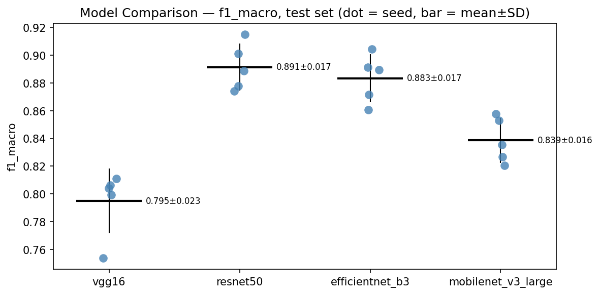
_Each dot is one seed. The bar is mean ± SD._

### 6.2 Statistical tests (Welch's t-test, n = 5 vs 5)
| Pair | Δ macro F1 | p (macro F1) | Hedges' g | p (weighted F1) |
|---|---|---|---|---|
| ResNet-50 vs EfficientNet-B3 | +0.008 | **0.485 (n.s.)** | 0.42 | 0.270 (n.s.) |
| ResNet-50 vs MobileNet-V3 | +0.053 | 0.001 | 2.88 | 0.003 |
| EfficientNet-B3 vs MobileNet-V3 | +0.045 | 0.003 | 2.41 | 0.001 |
| MobileNet-V3 vs VGG-16 | +0.044 | 0.011 | 1.96 | 0.002 |
| ResNet-50 vs VGG-16 | +0.096 | < 0.001 | 4.26 | < 0.001 |
| EfficientNet-B3 vs VGG-16 | +0.088 | < 0.001 | 3.87 | < 0.001 |

Full table: [`results_kaggle/ttest.csv`](results_kaggle/ttest.csv).

### 6.3 Per-class results (mean ± SD)
| F1 | dam_yen | khiao_nom | nom_khai_muk | phonlamai | thai |
|---|---|---|---|---|---|
| VGG-16 | 0.69 ± 0.06 | 0.81 ± 0.04 | 0.88 ± 0.03 | 0.84 ± 0.06 | 0.75 ± 0.03 |
| ResNet-50 | **0.85 ± 0.05** | 0.87 ± 0.03 | **0.96 ± 0.02** | **0.93 ± 0.02** | 0.86 ± 0.02 |
| EfficientNet-B3 | 0.73 ± 0.07 | **0.95 ± 0.01** | 0.95 ± 0.01 | 0.90 ± 0.02 | **0.88 ± 0.01** |
| MobileNet-V3-L | 0.71 ± 0.04 | 0.87 ± 0.03 | 0.93 ± 0.01 | 0.86 ± 0.01 | 0.82 ± 0.03 |

| Recall / Precision for `cha_dam_yen` | Recall | Precision |
|---|---|---|
| VGG-16 | 0.61 ± 0.06 | 0.80 ± 0.08 |
| ResNet-50 | 1.00 ± 0.00 | 0.74 ± 0.08 |
| EfficientNet-B3 | 0.86 ± 0.10 | 0.63 ± 0.06 |
| MobileNet-V3-L | 0.83 ± 0.08 | 0.63 ± 0.03 |

### 6.4 Confusion matrices (all 5 seeds pooled, row-normalised, so no single seed is cherry-picked)
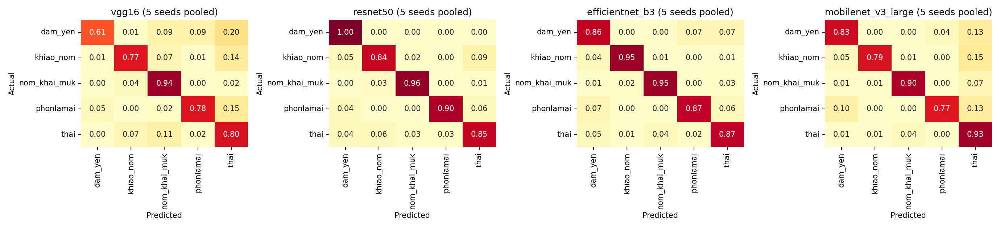

Most frequent errors (all models, wrong images per run): khiao_nom → thai 3.8 · phonlamai → thai 3.5 ·
thai → nom_khai_muk 2.6 · phonlamai → dam_yen 2.3 ([`confusion_pairs.csv`](results_kaggle/analysis/confusion_pairs.csv)).

### 6.5 Accuracy by image source
| Accuracy | Bing (n = 131) | Baidu (n = 28) | Delivery apps / FB (n = 23) |
|---|---|---|---|
| VGG-16 | 0.824 ± 0.017 | 0.736 ± 0.065 | 0.826 ± 0.043 |
| ResNet-50 | 0.907 ± 0.017 | 0.871 ± 0.032 | 0.878 ± 0.036 |
| EfficientNet-B3 | 0.915 ± 0.013 | 0.850 ± 0.030 | 0.922 ± 0.019 |
| MobileNet-V3-L | 0.855 ± 0.013 | 0.857 ± 0.044 | 0.852 ± 0.024 |

Hand-collected delivery-app photos score as well as web images, so the models did not learn a "source style".
Baidu (mostly watermarked stock photos) is lowest, but its n is small.

### 6.6 Class-imbalance strategies (ablation)
_ResNet-50, same split, same 5 seeds, default hyperparameters. Only the imbalance strategy changes
([`training/run_imbalance.py`](training/run_imbalance.py), raw: [`imbalance_runs.csv`](results_kaggle/imbalance_runs.csv))._

| Strategy | Macro F1 | Weighted F1 | Accuracy | `cha_dam_yen` recall | `cha_dam_yen` precision | `cha_dam_yen` F1 |
|---|---|---|---|---|---|---|
| None (plain CE) | **0.902 ± 0.012** | **0.906 ± 0.012** | **0.906 ± 0.012** | 0.96 ± 0.06 | 0.83 ± 0.04 | **0.89 ± 0.05** |
| Class-weighted CE (used in §6.1) | 0.891 ± 0.017 | 0.899 ± 0.014 | 0.898 ± 0.014 | **1.00 ± 0.00** | 0.74 ± 0.08 | 0.85 ± 0.05 |
| WeightedRandomSampler | 0.889 ± 0.009 | 0.894 ± 0.014 | 0.893 ± 0.013 | 0.99 ± 0.03 | 0.77 ± 0.04 | 0.86 ± 0.03 |
| Focal loss (γ = 2) | 0.881 ± 0.020 | 0.883 ± 0.025 | 0.882 ± 0.024 | 0.91 ± 0.06 | **0.85 ± 0.04** | 0.88 ± 0.02 |

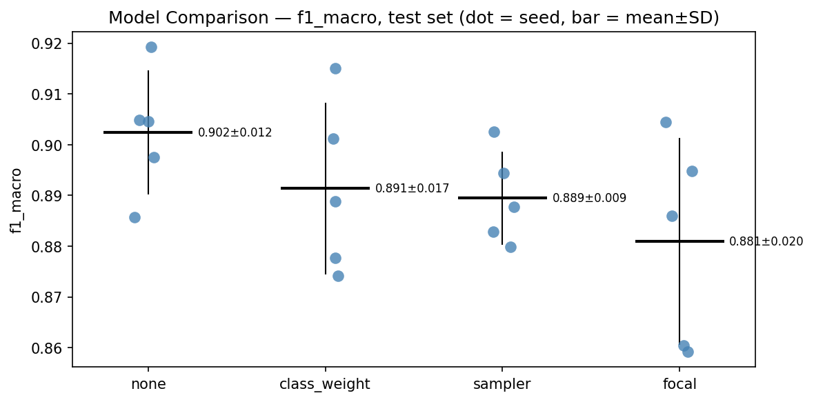

- **No strategy is significantly better than another on macro F1** (all 6 pairs p ≥ 0.09). "None" has the highest mean, but its lead
  over class weighting is small (p = 0.27, g = 0.68).
- The strategies mainly **move the `cha_dam_yen` decision boundary**. Class weighting and oversampling push recall to ~1.00 but let other
  dark drinks into the class (precision 0.74–0.77). Focal loss and no compensation keep precision at 0.83–0.85 with slightly lower recall.
  The only significant difference is recall: class weight vs focal loss (1.00 vs 0.91, p = 0.03, g = 1.83).
- **Interpretation.** At a 3 : 1 ratio, pretrained features already separate `cha_dam_yen` well, so re-weighting is not needed and mostly
  costs precision. Compensation would matter more at stronger imbalance.
- Sanity check: the class-weight row reproduces the ResNet-50 runs of §6.1 exactly (same seeds give identical F1), so runs are deterministic.
- We **keep class-weighted CE for the main comparison** because it was fixed before seeing any test result. Switching to "none" now would
  mean choosing a training setting on the test set.

### 6.7 Default vs tuned hyperparameters
All 4 models re-trained with the tuned values (§4.3): same split, same 5 seeds, test set
([`results_kaggle/tuned/`](results_kaggle/tuned/)).

| Model | Macro F1, default | Macro F1, tuned | Δ | Welch p | Hedges' g | Weighted F1, tuned |
|---|---|---|---|---|---|---|
| VGG-16 | 0.795 ± 0.023 | **0.818 ± 0.027** | +0.023 | 0.20 | 0.81 | 0.832 ± 0.028 |
| ResNet-50 | **0.891 ± 0.017** | 0.883 ± 0.016 | −0.008 | 0.46 | −0.45 | 0.891 ± 0.014 |
| EfficientNet-B3 | **0.883 ± 0.017** | 0.879 ± 0.013 | −0.005 | 0.66 | −0.26 | 0.903 ± 0.010 |
| MobileNet-V3-L | 0.839 ± 0.016 | **0.842 ± 0.021** | +0.003 | 0.79 | 0.16 | 0.863 ± 0.020 |

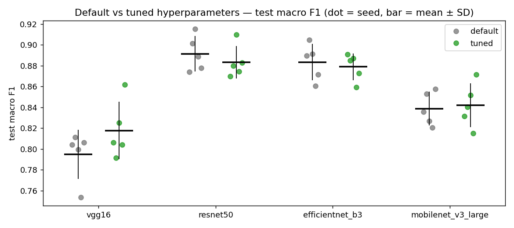

- **Tuning changed no model significantly** (all p ≥ 0.20). Only VGG-16 gains noticeably (+0.023, g = 0.81). It was the worst model and
  furthest from its best settings: the tuned run uses a shorter stage 1, a longer stage 2 and label smoothing 0.1.
- **Why so little gain:** (1) the search picks the configuration that is best on *one seed* and *93 validation images*, where many
  configurations tie within 1 image, so part of the "improvement" is noise; (2) the defaults were already reasonable two-stage settings.
- **The ranking is unchanged.** Tuned: ResNet-50 ≈ EfficientNet-B3 (p = 0.64) > MobileNet-V3 > VGG-16. With tuning, MobileNet-V3 vs VGG-16
  is **no longer significant** (p = 0.16), so the clear gap is between the modern pair and the two others.
- Main tables (§6.1–6.6) and the analyses in §7 use the default runs. Tuning did not change any conclusion, so we report it as a robustness check.

---

## 7. Discussion & conclusions

### 7.1 Best and worst architecture
- **ResNet-50 and EfficientNet-B3 are the best and statistically tied** (macro F1 0.891 vs 0.883, p = 0.48, small effect g = 0.42).
  ResNet-50 is slightly better on macro F1 (it never misses `cha_dam_yen`). EfficientNet-B3 is slightly better on weighted F1 / accuracy
  (stronger on the large classes, especially `cha_khiao_nom` F1 0.95). EfficientNet reaches this with 2.2× fewer parameters.
- **MobileNet-V3-Large** is ~5 points lower but still respectable for a 4.2 M-parameter model.
- **Most suitable for our use case:** **ResNet-50** if the goal is recognising every drink equally well
  (best macro F1, best `cha_dam_yen` F1 0.85). **EfficientNet-B3** if model size matters (statistically tied, 2.2× fewer parameters).
  **MobileNet-V3-Large** for an on-phone menu app, at a cost of ~5 F1 points.
- **VGG-16 is clearly the worst** (all p ≤ 0.011, |g| ≥ 1.96) even though it has the most parameters (134 M). Its train-val F1 gap
  (0.056) is similar to ResNet-50's (0.049, §4.2), so plain overfitting does not explain it. What differs is that VGG-16 has
  **the highest validation loss (0.51 vs 0.21–0.28) and the noisiest validation curve**, i.e. its predictions are less confident and less
  stable. Likely reasons: no skip connections or batch norm, and stage 2 fine-tunes ~127 M parameters (mostly the two FC-4096 layers)
  on only 638 images. It also has the widest spread between seeds (one seed at 0.754).

### 7.2 Anomalies
- **`cha_dam_yen` is over-predicted.** ResNet-50 reaches recall 1.00 but precision 0.74, and EfficientNet / MobileNet have precision 0.63.
  The class weight (~2.5×) on a class with only 51 training images pushes borderline dark drinks (dark fruit teas, some green teas in dark cups)
  into `cha_dam_yen`. VGG-16 shows the opposite (recall 0.61), confusing dark tea with Thai tea. The ablation (§6.6) confirms the cause:
  without class weights ResNet-50's `cha_dam_yen` precision rises from 0.74 to 0.83 and macro F1 does not drop (0.902 vs 0.891, n.s.).
- **`cha_thai` absorbs most errors** (it is the most common predicted class among mistakes). Orange is shared by Thai tea, peach and passion-fruit teas.

### 7.3 GradCAM: correct vs misclassified
GradCAM on the **last conv block** of the best seed of each top model (ResNet-50 seed 33, EfficientNet-B3 seed 22), computed for
**every misclassified test image** (15 each) and for 2 correct images per class. Re-run locally from the Kaggle checkpoints; the
predictions match the Kaggle run exactly (accuracy 0.918 for both). Code: [`training/error_analysis.py`](training/error_analysis.py).

**Correct predictions (ResNet-50, 2 per class):**
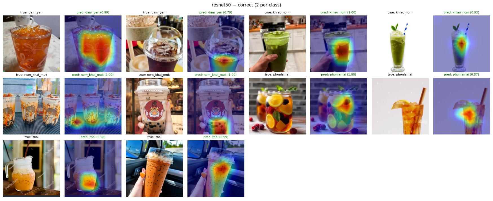

**All misclassified test images, ResNet-50** (title = true class / predicted class and confidence, most confident first):
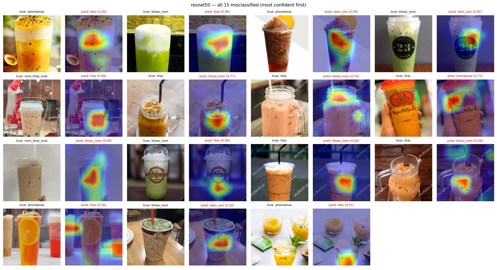

**All misclassified test images, EfficientNet-B3:**
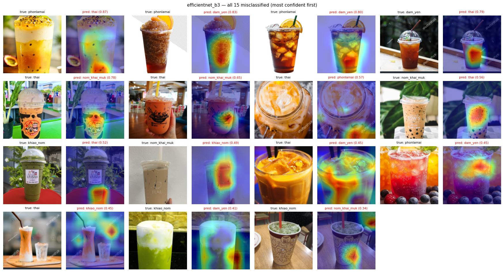

What GradCAM shows:
- **Correct predictions look at the liquid**: the centre of the drink for Thai and green milk tea, the pearl layer at the bottom of bubble
  tea, the fruit slices inside fruit tea. These are the cues a person would use.
- **Fruit tea → black tea / Thai tea (the most frequent error):** on the dark iced fruit teas the heatmap sits on the **clear brown
  liquid**, not on the orange slice on the rim, so the model reads "dark clear tea" = `cha_dam_yen`. On the passion-fruit tea it sits on
  the orange-yellow middle layer and ignores the seeds and passion fruit beside the cup, so it reads "orange milky drink" = `cha_thai`.
  **Colour wins over the fruit.**
- **Logos and printed cups:** the ChaTraMue Thai tea (→ fruit tea) and the green tea with a big red shop logo (→ Thai tea) are wrong
  because the heatmap is on the **logo**, which is red-orange. For the printed paper cup (→ black tea / bubble tea) there is no liquid
  to look at, so the model focuses on the cup print.
- **Watermarks and background:** on Shutterstock images both models put part of their attention on the watermark or the table and
  predict a lighter class (Thai tea → green milk tea).
- **Text overlays:** the bubble tea with hand-drawn hearts and Thai text is wrong in nearly all runs (→ Thai tea). The heatmap is on the
  milky body of the drink, while the pearls are small and partly hidden behind the drawing.
- **The two models disagree on several images.** EfficientNet-B3 gets the ChaTraMue cup right by looking *below* the logo, but it
  misreads a dark black tea in a stock photo as Thai tea, which ResNet-50 classifies correctly. This is consistent with the two being
  statistically tied overall while making different individual mistakes.

### 7.4 Eyeball comparison: ImageNet baseline vs VGG-16 vs ResNet-50
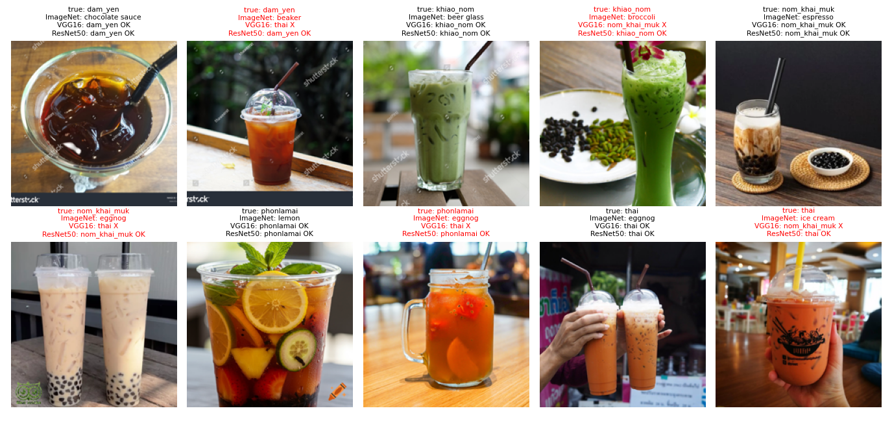
_Same test images. Red title = VGG-16 wrong. Best seed per model (VGG-16 seed 22, ResNet-50 seed 33)._
The ImageNet model gives object labels (_beaker_, _eggnog_, _broccoli_) that do not match drink types. After fine-tuning both models get the
easy images right. ResNet-50 also gets cases VGG-16 misses: a black tea in a stock photo with a watermark, a bright green tea next to
coffee beans, Thai tea in a branded cup.

### 7.5 Error analysis of underperforming classes
16 test images are misclassified in at least half of the 20 runs (all models × seeds), see [`hard_images.csv`](results_kaggle/analysis/hard_images.csv):

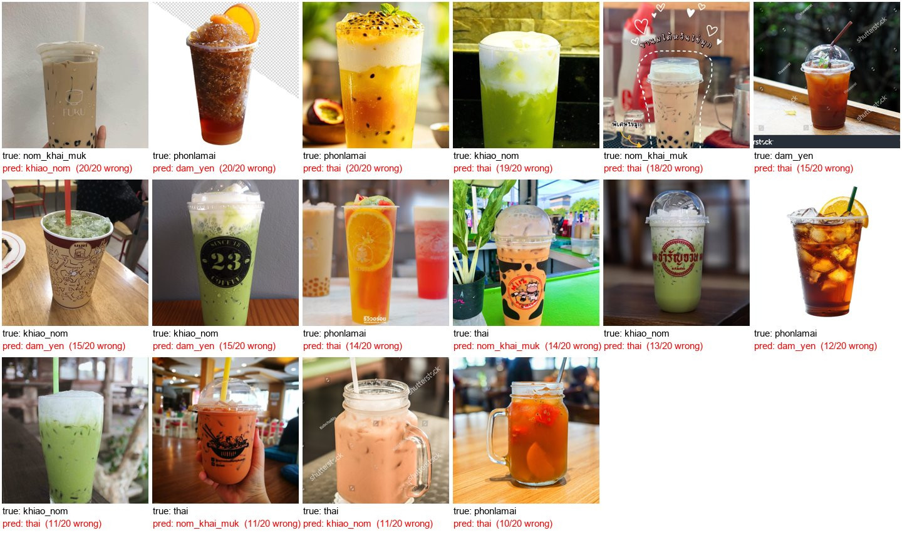

Common patterns:
1. **Colour overlaps between classes.** Passion-fruit / orange teas → Thai tea. **Dark iced tea garnished with an orange slice** → black tea
   (20/20 runs wrong). Here the label boundary itself is unclear: is it a fruit tea or a black tea with garnish?
2. **The drink is hidden.** Opaque paper cups, large shop logos or stickers covering the cup.
3. **Overlays.** Text, hand-drawn hearts, Shutterstock watermarks.
4. **The key cue is not visible.** Bubble tea whose pearls are hidden at the bottom, very pale Thai tea that looks pink or beige.

The models rely mainly on **colour**. This matches the augmentation choice: `ColorJitter(hue = 0.1)` and `RandomGrayscale` weaken the colour
cue only slightly, and texture cues (pearls, fruit pieces) are learned less reliably.
These test images were **not** relabelled or removed after we saw the results, because that would be test-set snooping.

### 7.6 Focus on the problem class: `cha_dam_yen`
All test images predicted as `cha_dam_yen` while being another class (**FP**, red) or `cha_dam_yen` predicted as something else
(**FN**, blue) in ≥ 3 of the 20 runs ([`cha_dam_yen_errors.csv`](results_kaggle/analysis/cha_dam_yen_errors.csv)):

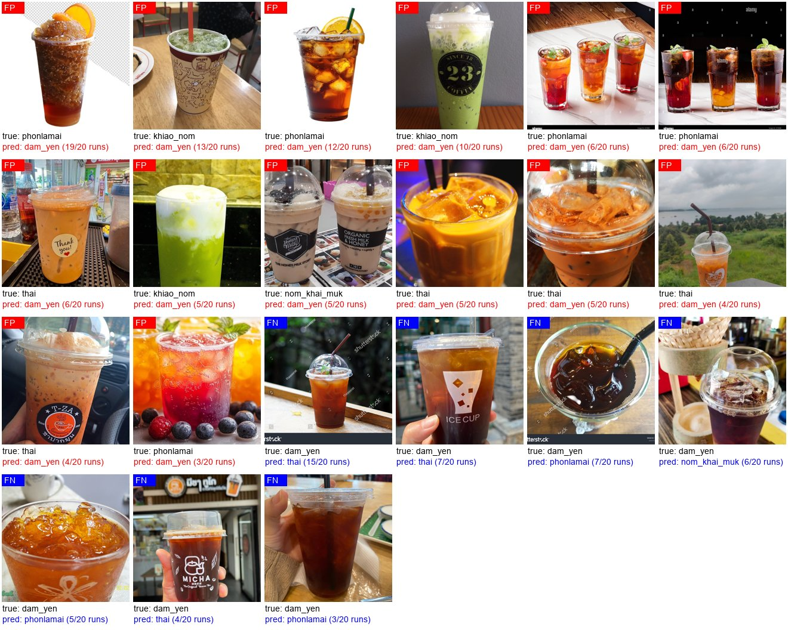

| Per run | VGG-16 | ResNet-50 | EfficientNet-B3 | MobileNet-V3-L |
|---|---|---|---|---|
| False positives (other → dam_yen) | 2.2 | 5.2 | 7.0 | 6.8 |
| False negatives (dam_yen → other) | 5.4 | **0.0** | 2.0 | 2.4 |

- **Where the false positives come from:** fruit tea (46 of 106 FP predictions), green milk tea (29), Thai tea (26), bubble tea (5).
  The repeat offenders are **dark iced fruit teas** (clear brown-red tea with an orange or peach slice, wrong in up to 19/20 runs),
  Thai tea photographed in **dim light** (looks dark orange-brown), and drinks in **opaque or printed cups**. In all of them the
  visible liquid is dark and clear, which is the main cue for `cha_dam_yen`.
- **False negatives** are black teas whose liquid is barely visible: branded cups covering the drink (ICE CUP, MICHA), a watermarked
  stock photo, a wide bowl seen from above, and a lighter, orange-tinted black tea that looks like Thai or fruit tea.
- **The models trade FP for FN differently.** ResNet-50 never misses a black tea but accepts ~5 wrong ones per run. VGG-16 does the opposite.
  This matches §6.6: removing the class weight lowers ResNet-50's false positives (precision 0.74 → 0.83).
- **Fix ideas:** collect more black-tea photos in branded or opaque cups, and more dark fruit teas *labelled as fruit tea*, so the model
  must look at fruit pieces rather than liquid colour. A clearer rule for "fruit tea" (fruit must be in the drink, not only a garnish) would
  also remove the ambiguous cases.

### 7.7 Limitations
- **Small minority class.** `cha_dam_yen` has only 14 test images (1 image ≈ 7 % recall), so its per-class numbers are noisy.
- **SD covers training randomness only.** The 5 seeds share one split, so variance from the choice of data is not included.
- **Tuning on one seed and a small validation set.** Hyperparameters were selected from single-seed runs scored on 93 validation
  images, which is noisy. Selecting by the mean over several seeds, or by cross-validation, would be more reliable but costs 3–5× more GPU.
- **Web images are biased** toward stylised marketing and stock photos. Real street-stall photos are a minority (112 hand-collected).

### 7.8 Conclusions
Fine-tuning ImageNet CNNs on fewer than 1,000 curated images separates 5 visually similar tea drinks with **~0.89 macro F1**.
Architecture matters: modern families (ResNet, EfficientNet) beat VGG by ~9 F1 points with large, significant effects, while ResNet-50 and
EfficientNet-B3 are statistically tied. Hyperparameter tuning with Optuna and W&B Sweep confirmed this ranking but did not significantly
improve any model. The remaining errors come mostly from drinks whose colours overlap between classes and from images
where the drink is partly hidden. Clearer class definitions (e.g. "fruit tea must show fruit in the drink") and more `cha_dam_yen`
photos are the most promising improvements.

---

## 8. Reproducibility

```
chanet_scraper.py        # scraping (Bing via ddgs, Baidu via icrawler) + pHash dedup -> tea_dataset/metadata.csv
chanet_curate.py         # CLIP triage, contact sheets, manual decisions, sync/ingest -> metadata_clean.csv
tea_dataset/
  metadata_clean.csv     # 913 curated images (images themselves are not in git: copyright)
  split.csv              # fixed group split
training/
  make_split.py          # build split.csv
  config.py dataset.py models.py trainer.py losses.py utils.py
  pilot.py               # ResNet-50 group vs random split (leakage check)
  run_final.py           # 4 archs x 5 seeds -> results/runs.csv, preds/, plots, t-tests
  run_imbalance.py       # imbalance-strategy ablation
  run_tune_optuna.py     # Optuna tuning (TPE + median pruning), per architecture
  run_sweep.py           # W&B Sweep tuning (Bayesian), per architecture
  tuning.py              # shared search space, trial runner, best_hparams selection
  analyze_preds.py       # confusion matrices, error pairs, accuracy by source, hard images
  report_figures.py      # EDA / baseline / eyeball / learning-curve figures in report/
notebooks/03_kaggle_train.ipynb   # Kaggle GPU runner
results_kaggle/          # final results used in this report (default run, imbalance ablation, logs)
  tuning/                # all tuning trials + selected hyperparameters
  tuned/                 # 4 archs x 5 seeds re-trained with tuned hyperparameters
report/                  # figures for this README
```

Run on Kaggle (GPU T4): upload the 913 images as a Kaggle dataset, then run `notebooks/03_kaggle_train.ipynb`.
Locally: `python training/run_final.py`, then `python training/analyze_preds.py --results <dir>` and `python training/report_figures.py`.
Internal team notes: [`docs/TEAM_NOTES.md`](docs/TEAM_NOTES.md).
